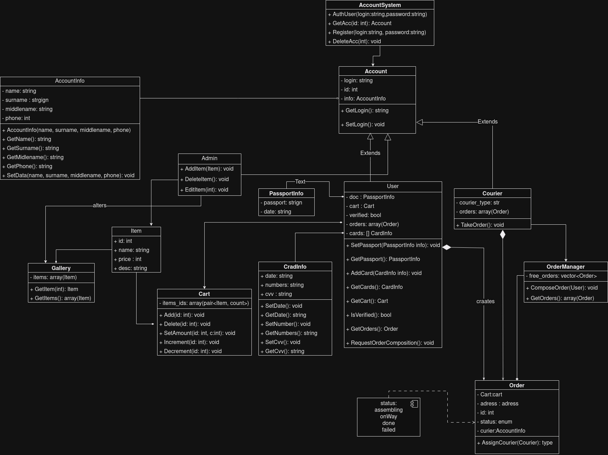

# Drinker

## Description 

Our project is aimed at the practice of software architecture design

### Built With
Backend - Python,  Flask, PHP

Frontend - JavaScript, React

## Getting Started

### Installation

If you want to use your bot with my code:

```
git clone https://github.com/Pe4eNPe4eNkI/Drinker.git
```

## UML 


